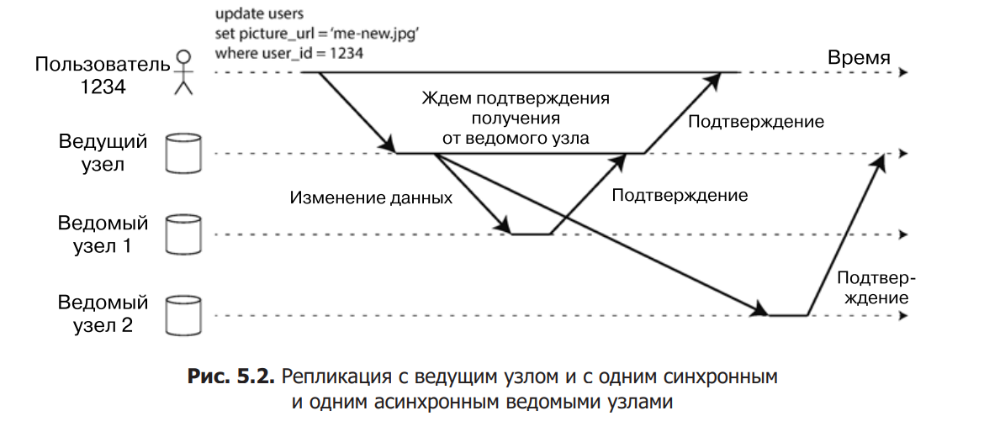

# Технологии обеспечения отказоустойчивости
- Репликация данных: Процесс копирования данных с одного места на другое, чтобы обеспечить их доступность и целостность в случае сбоя. Существует синхронная и асинхронная репликация.
- Использование резервных копий: Регулярное создание копий данных для их восстановления в случае потери или повреждения. Резервное копирование может быть полным, инкрементальным или дифференциальным.
- Дедупликация данных: Технология, позволяющая уменьшить объем хранимых данных за счет удаления дублирующихся копий данных. Это повышает эффективность использования хранилища и снижает затраты.
- Методы восстановления после сбоев: Различные подходы и стратегии для восстановления данных и систем после сбоев. Примеры включают резервное копирование и восстановление, переключение на резервные системы (failover) и планирование непрерывности бизнеса (BCP).

## Алгоритмы балансировки нагрузки
- Round Robin: Запросы распределяются поочередно по всем серверам в группе.
- Least Connections: Запрос направляется на сервер с наименьшим количеством активных подключений.
- IP Hash: Запрос направляется на сервер на основе хэширования IP-адреса клиента.
- Least Response Time: Запрос направляется на сервер, который наиболее быстро отвечает на предыдущие запросы.
- Weighted Round Robin: Каждый сервер имеет "вес", и запросы распределяются с учетом этих весов.

## Отказоустойчивые приложения
Узлы, в которых хранятся копии БД, называются _репликами_.

Каждая операция записи в базу должна учитываться каждой репликой, иначе нельзя гарантировать, что реплики содержат одни и те же данные. Наиболее распространенное решение этой проблемы называется репликацией с ведущим узлом (leader-based replication)

1. Одна из реплик назначается ведущим (leader) узлом. Клиенты, желающие записать данные в базу, должны отправить свои запросы ведущему узлу, который сначала записывает новые данные в свое локальное хранилище.
2. Другие реплики называются ведомыми (followers) узлами . Всякий раз, когда ведущий узел записывает в свое хранилище новые данные, он также отправляет информацию об изменениях данных всем ведомым узлам в качестве части журнала репликации (replication log) или потока изменений (change stream). Все ведомые узлы получают журнал от ведущего и обновляют соответствующим образом свою локальную копию БД, применяя все операции записи в порядке их обработки ведущим узлом.
3.  Когда клиенту требуется прочитать данные из базы, он может выполнить запрос или к ведущему узлу, или к любому из ведомых. Однако запросы на запись разрешено отправлять только ведущему (ведомые с точки зрения клиента предназначены только для чтения).

На примере из рис. 5.2 репликация на ведомый узел 1 __синхронна__: ведущий узел ждет до тех пор, пока ведомый узел 1 не подтвердит получение операции записи, прежде чем сообщить пользователю об успехе и сделать результаты записи видимыми другим клиентам. Репликация на ведомый узел 2 асинхронна: ведущий узел отправляет сообщение, но не ждет ответа от ведомого. 
